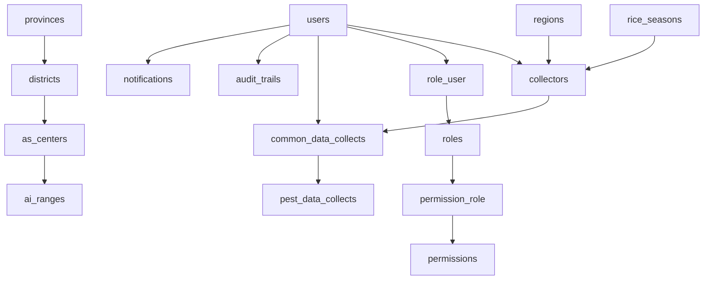

# Project Database Schema and Relationships

This document summarizes the database schema discovered in the current Laravel project based on the migration files and Eloquent models.

## 1. Database overview

The project is a Laravel application using MySQL/Postgres-style relational tables with Laravel Eloquent models. The main functional domain is pest surveillance and field data collection for agricultural officers and collectors.

### Key conventions used in the project

- UUID primary keys are used for users, roles, permissions, notifications, audit logs, and related auth/security tables.
- Most lookup tables use integer auto-increment IDs.
- Several models use soft deletes (`deleted_at`).
- Foreign keys are defined directly in migrations and also reflected in model relationships.
- Some relationship names use legacy/custom foreign keys, such as `district`, `province`, `asc`, and `ai_range` on the `collectors` table.

---

## 2. Core tables and data types

### Users and authentication

| Table             | Purpose                           | Main columns and types                                                                                                                                                                                                                                                                                                                                                                                                                                                                                                                              |
| ----------------- | --------------------------------- | --------------------------------------------------------------------------------------------------------------------------------------------------------------------------------------------------------------------------------------------------------------------------------------------------------------------------------------------------------------------------------------------------------------------------------------------------------------------------------------------------------------------------------------------------- |
| `users`           | System users / agricultural staff | `id` UUID PK; `name` string; `slug` string; `email` string unique; `password` nullable string; `image` nullable string; `is_office_login_only` boolean; `is_active` boolean; `last_logged_in_at` timestamp nullable; `two_fa_active` string default `No`; `two_fa_secret_key` nullable string; `invited_by` UUID nullable; `invited_at` timestamp nullable; `joined_at` timestamp nullable; `invite_token` nullable string; `last_activity` timestamp nullable; `remember_token` string nullable; `created_at`,`updated_at`,`deleted_at` timestamps |
| `password_resets` | Password reset records            | `email` string; `token` string; `created_at` timestamp                                                                                                                                                                                                                                                                                                                                                                                                                                                                                              |
| `failed_jobs`     | Laravel failed queue jobs         | standard queued job metadata (`uuid`, `connection`, `queue`, `payload`, `exception`, `failed_at`)                                                                                                                                                                                                                                                                                                                                                                                                                                                   |
| `sent_emails`     | Email audit log                   | `id` UUID PK; `date` date nullable; `from` string nullable; `to` text nullable; `cc` text nullable; `bcc` text nullable; `subject` string nullable; `body` text; `created_at`,`updated_at`                                                                                                                                                                                                                                                                                                                                                          |
| `settings`        | App settings / config overrides   | `id` UUID PK; `key` string; `value` string nullable; `created_at`,`updated_at`                                                                                                                                                                                                                                                                                                                                                                                                                                                                      |
| `audit_trails`    | User action/activity history      | `id` UUID PK; `user_id` UUID nullable; `title` string; `link` text nullable; `reference_id` UUID nullable; `section` string; `type` string; `created_at`,`updated_at`,`deleted_at`                                                                                                                                                                                                                                                                                                                                                                  |
| `notifications`   | Notifications sent to users       | `id` UUID PK; `title` string; `assigned_to_user_id` UUID; `assigned_from_user_id` UUID default 0; `link` string nullable; `viewed` boolean nullable; `viewed_at` timestamp nullable; `created_at`,`updated_at`                                                                                                                                                                                                                                                                                                                                      |

### Roles and permissions

| Table             | Purpose                                         | Main columns and types                                                                                                 |
| ----------------- | ----------------------------------------------- | ---------------------------------------------------------------------------------------------------------------------- |
| `roles`           | User roles                                      | `id` UUID PK; `name` string; `label` string nullable; `created_at`,`updated_at`,`deleted_at`                           |
| `permissions`     | Access permissions                              | `id` UUID PK; `name` string; `label` string nullable; `module` string nullable; `created_at`,`updated_at`,`deleted_at` |
| `permission_role` | Many-to-many join between permissions and roles | `id` auto-increment; `permission_id` UUID; `role_id` UUID                                                              |
| `role_user`       | Many-to-many join between users and roles       | `id` auto-increment; `role_id` UUID; `user_id` UUID                                                                    |

### Geographic and administrative tables

| Table          | Purpose                              | Main columns and types                                                                                                                               |
| -------------- | ------------------------------------ | ---------------------------------------------------------------------------------------------------------------------------------------------------- |
| `provinces`    | Province master data                 | `id` bigint PK; `name` string unique; `created_at`,`updated_at`                                                                                      |
| `districts`    | District master data                 | `id` bigint PK; `code` integer nullable; `name` string; `province_id` bigint FK to `provinces`; `created_at`,`updated_at`                            |
| `as_centers`   | Agricultural service centers         | `id` bigint PK; `name` string; `district_id` bigint FK to `districts`; `created_at`,`updated_at`                                                     |
| `ai_ranges`    | AI ranges / extension coverage areas | `id` bigint PK; `name` string; `as_center_id`? (model suggests belongsTo `As_center`; migration not visible, but likely foreign key to `as_centers`) |
| `regions`      | Regions                              | `id` bigint PK; `name` string; `created_at`,`updated_at`                                                                                             |
| `rice_seasons` | Rice cultivation seasons             | `id` bigint PK; `name` string; `start_date` date; `end_date` date; `created_at`,`updated_at`                                                         |

### Pest surveillance tables

| Table                  | Purpose                                          | Main columns and types                                                                                                                                                                                                                                                                                                                                                                                                                                                          |
| ---------------------- | ------------------------------------------------ | ------------------------------------------------------------------------------------------------------------------------------------------------------------------------------------------------------------------------------------------------------------------------------------------------------------------------------------------------------------------------------------------------------------------------------------------------------------------------------- |
| `pests`                | Pest catalog                                     | `id` bigint PK; `name` string; `created_at`,`updated_at`                                                                                                                                                                                                                                                                                                                                                                                                                        |
| `collectors`           | Collector profile records for field officers     | `id` bigint PK; `rice_season_id` bigint FK to `rice_seasons`; `phone_no` string; `user_id` UUID FK to `users`; `region_id` bigint FK to `regions`; `province` bigint FK to `provinces`; `district` bigint FK to `districts`; `asc` bigint FK to `as_centers`; `ai_range` bigint FK to `ai_ranges`; `village` string nullable; `gps_lati` string nullable; `gps_long` string nullable; `rice_variety` string nullable; `date_establish` date nullable; `created_at`,`updated_at` |
| `common_data_collects` | Daily collector entry / common field observation | `id` bigint PK; `user_id` char/string FK to `users`; `collector_id` bigint FK to `collectors`; `c_date` date; `temperature` string; `numbrer_r_day` string; `growth_s_c` string; `otherinfo` string nullable default `No Other Info`; `created_at`,`updated_at`                                                                                                                                                                                                                 |
| `pest_data_collects`   | Pest counts by location for a collected record   | `id` bigint PK; `common_data_collectors_id` bigint FK to `common_data_collects`; `pest_name` string; `location_1`..`location_10` integer; `total` integer nullable; `mean` integer; `code` integer; `created_at`,`updated_at`                                                                                                                                                                                                                                                   |
| `conducted_programs`   | Conducted agricultural awareness programs        | `id` bigint PK; `program_name` string; `district` string; `conducted_date` date; `start_time` time; `end_time` time; `participants_count` integer; `other_details` string nullable; `created_at`,`updated_at`                                                                                                                                                                                                                                                                   |

---

## 3. Model contents (what each Eloquent model contains)

The project uses Laravel Eloquent models to represent the database entities. The models below summarize the main class responsibilities and the data/relationships each one exposes.

### User

- File: `app/Models/User.php`
- Main fields represented by the model: `id`, `name`, `slug`, `email`, `password`, `image`, `is_office_login_only`, `is_active`, `last_logged_in_at`, `two_fa_active`, `two_fa_secret_key`, `invited_by`, `invited_at`, `joined_at`, `invite_token`, `last_activity`.
- Traits: `HasUuid`, `HasRoles`, `SoftDeletes`, `HasApiTokens`, `HasFactory`, `Notifiable`.
- Relationships:
    - `collector()` → one `Collector`
    - `commonDataCollect()` → many `CommonDataCollect`
    - `roleUsers()` → one `RoleUser`
    - `invite()` → one `User` (for invitation chain)

### Role and Permission models

- `app/Models/Roles/Role.php`
    - Fields: `id`, `name`, `label`, timestamps, soft delete
    - Relationships: `permissions()` → many `Permission`; `hasPermission()` and `syncPermissions()` helper logic
- `app/Models/Roles/Permission.php`
    - Fields: `id`, `name`, `label`, `module`, timestamps, soft delete
    - Relationships: `roles()` → many `Role`
- `app/Models/Roles/RoleUser.php`
    - Table: `role_user`
    - Fields: `id`, `role_id`, `user_id`
    - Relationship: `role()` → belongs to `Role`

### Notification and AuditTrail

- `app/Models/Notification.php`
    - Fields: `id`, `title`, `assigned_to_user_id`, `assigned_from_user_id`, `link`, `viewed`, `viewed_at`
    - Relationships: `assignedTo()` and `assignedFrom()` → `User`
- `app/Models/AuditTrail.php`
    - Fields: `id`, `user_id`, `title`, `link`, `reference_id`, `section`, `type`
    - Relationship: `user()` → belongs to `User`

### Geographic models

- `app/Models/Province.php`
    - Fields: `id`, `name`
    - Relationships: `district()` → many `district`; `collector()` → many `Collector`
- `app/Models/district.php`
    - Table: `districts`
    - Fields: `id`, `code`, `name`, `province_id`
    - Relationships: `province()` → belongs to `Province`; `As_center()` → has many `As_center`
- `app/Models/As_center.php`
    - Fields: `id`, `name`, `district_id`
    - Relationships: `district()` → belongs to `district`; `AiRange()` → has many `AiRange`
- `app/Models/AiRange.php`
    - Fields: `id`, `name` (with likely `as_center_id` in the DB)
    - Relationship: `as_center()` → belongs to `As_center`
- `app/Models/Region.php`
    - Fields: `id`, `name`
    - No custom relationships defined in the model yet
- `app/Models/RiceSeason.php`
    - Fields: `id`, `name`, `start_date`, `end_date`
    - Relationship: `collector()` → has many `Collector`

### Pest and field-surveillance models

- `app/Models/Pest.php`
    - Fields: `id`, `name`
    - No custom relationship logic in the model
- `app/Models/Collector.php`
    - Fields: `id`, `rice_season_id`, `phone_no`, `user_id`, `region_id`, `province`, `district`, `asc`, `ai_range`, `village`, `gps_lati`, `gps_long`, `rice_variety`, `date_establish`
    - Relationships:
        - `getDistrict()` → belongs to `district`
        - `getProvince()` → belongs to `Province`
        - `getAsCenter()` → belongs to `As_center`
        - `getAiRange()` → belongs to `AiRange`
        - `user()` → belongs to `User`
        - `riceSeason()` → belongs to `RiceSeason`
        - `region()` → belongs to `Region`
        - `commonDataCollect()` → has many `CommonDataCollect`
- `app/Models/CommonDataCollect.php`
    - Fields: `id`, `user_id`, `collector_id`, `c_date`, `temperature`, `numbrer_r_day`, `growth_s_c`, `otherinfo`
    - Relationships:
        - `user()` → belongs to `User`
        - `pestDataCollect()` → has many `PestDataCollect`
        - `collector()` → belongs to `Collector`
- `app/Models/PestDataCollect.php`
    - Fields: `id`, `common_data_collectors_id`, `pest_name`, `location_1`..`location_10`, `total`, `mean`, `code`
    - Relationships:
        - `commonDataCollect()` → belongs to `CommonDataCollect`
        - `pest()` → belongs to `Pest` (defined but not enforced by DB column)

### Supporting operational models

- `app/Models/ConductedProgram.php`
    - Fields: `program_name`, `district`, `conducted_date`, `start_time`, `end_time`, `participants_count`, `other_details`
    - No custom relationships defined
- `app/Models/Setting.php`
    - Fields: `id`, `key`, `value`
    - Uses `HasUuid` for UUID primary key generation
- `app/Models/SentEmail.php`
    - Fields: `id`, `date`, `from`, `to`, `cc`, `bcc`, `subject`, `body`
    - Uses `HasUuid` and factory support

---

## 4. Model relationship summary

### 1) User relationships

- `User` has many `CommonDataCollect` records
- `User` has one `Collector`
- `User` has one `RoleUser`
- `User` may be invited by another user via `invited_by`
- `User` can have many role assignments through `role_user`

### 2) Role relationships

- `Role` belongs to many `Permission` via `permission_role`
- `Role` belongs to many `User` via `role_user`
- `Permission` belongs to many `Role` via `permission_role`

### 3) Province / district / AS center / AI range structure

- `Province` has many `district`
- `district` belongs to one `Province`
- `district` has many `As_center`
- `As_center` belongs to one `district`
- `As_center` has many `AiRange`
- `AiRange` belongs to one `As_center`

### 4) Collector and observation hierarchy

- `Collector` belongs to one `User`
- `Collector` belongs to one `RiceSeason`
- `Collector` belongs to one `Region`
- `Collector` belongs to one `Province` via custom key `province`
- `Collector` belongs to one `district` via custom key `district`
- `Collector` belongs to one `As_center` via custom key `asc`
- `Collector` belongs to one `AiRange` via custom key `ai_range`
- `Collector` has many `CommonDataCollect`

- `CommonDataCollect` belongs to one `User`
- `CommonDataCollect` belongs to one `Collector`
- `CommonDataCollect` has many `PestDataCollect`

- `PestDataCollect` belongs to one `CommonDataCollect`
- `PestDataCollect` also declares a relationship to `Pest`, but the migration stores only `pest_name` as a string instead of a foreign key; this means the DB relationship is not enforced at the database level.

### 5) Audit and notification relationships

- `AuditTrail` belongs to `User` via `user_id`
- `Notification` belongs to a target user (`assigned_to_user_id`) and a sender user (`assigned_from_user_id`)

---

## 5. Relationship map

---

## 6. Important data-model notes

- `users.id` is a UUID, but other tables like `collectors` use integer IDs. This is valid as long as the FK definition is implemented carefully.
- `role_user` and `permission_role` are explicit pivot tables using auto-increment IDs with UUID foreign keys.
- `collectors` uses custom foreign key column names (`province`, `district`, `asc`, `ai_range`) instead of Laravel default names. This is important for any future queries or migrations.
- `pest_data_collects` stores pest counts per location in numbered columns (`location_1` to `location_10`) and computes `total` and `mean` in code.
- `conducted_programs` is a supporting operational table and is not part of the main surveillance/field-data chain.

---

## 7. Summary of the main data flow

The project mainly follows this pattern:

1. `users` create their account and are assigned roles.
2. Each user can have a collector record (`collectors`).
3. A collector creates one or more daily field entries (`common_data_collects`).
4. Each field entry can contain multiple pest observations (`pest_data_collects`).
5. Geographic data is layered through `province` → `district` → `as_center` → `ai_range`.
6. Audit trails and notifications track system activity and user communication.

---

## 8. Files used to generate this schema

- `database/migrations/*`
- `app/Models/*.php`
- `app/Models/Roles/*.php`

This document is intended as a practical reference for understanding the project’s core database structure and entity relationships.
