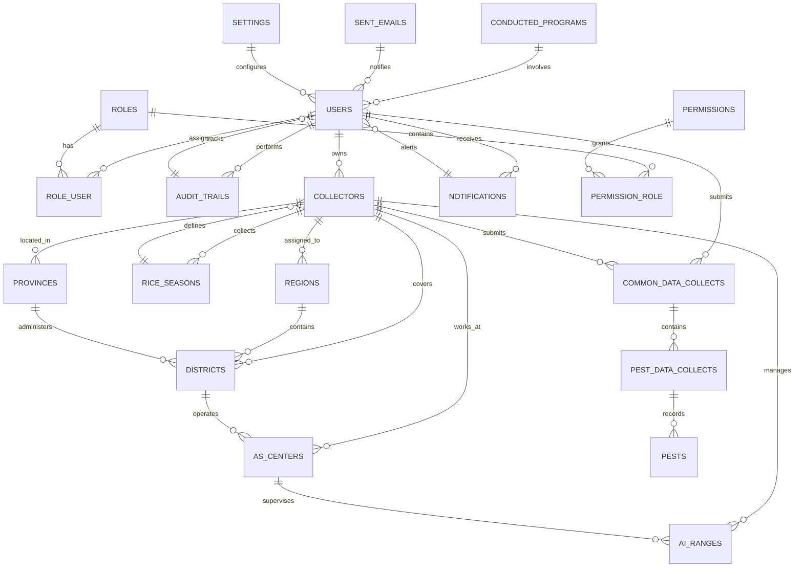

# Entity-Relationship (ER) Diagram - Pest Surveillance System

## Overview
This document contains a comprehensive Entity-Relationship (ER) diagram for the Pest Surveillance System database schema, including detailed entity definitions, attributes, relationships, and cardinalities.

---

## Full ER Diagram (Mermaid)



---

## Detailed Entity Schema

### 1. **USERS** 
Core user account table with authentication and profile information.

| Attribute | Type | Constraints | Description |
|-----------|------|-------------|-------------|
| id | UUID | PRIMARY KEY | Unique user identifier |
| name | STRING | NOT NULL | User full name |
| slug | STRING | NOT NULL | URL-friendly username |
| email | STRING | UNIQUE, NOT NULL | Email address |
| password | STRING | NULLABLE | Hashed password |
| image | STRING | NULLABLE | Profile picture URL |
| is_office_login_only | BOOLEAN | DEFAULT: true | Office-only access restriction |
| is_active | BOOLEAN | DEFAULT: true | User account status |
| last_logged_in_at | TIMESTAMP | NULLABLE | Last login timestamp |
| two_fa_active | STRING | DEFAULT: 'No' | Two-factor auth status |
| two_fa_secret_key | STRING | NULLABLE | 2FA secret for TOTP |
| invited_by | UUID | NULLABLE | FK to inviting user |
| invited_at | TIMESTAMP | NULLABLE | Invitation timestamp |
| joined_at | TIMESTAMP | NULLABLE | Account creation timestamp |
| invite_token | STRING | NULLABLE | Invitation token |
| last_activity | TIMESTAMP | NULLABLE | Last activity timestamp |
| remember_token | STRING | NULLABLE | Remember me token |
| created_at | TIMESTAMP | AUTO | Record creation time |
| updated_at | TIMESTAMP | AUTO | Last update time |
| deleted_at | TIMESTAMP | NULLABLE | Soft delete timestamp |

**Relationships:**
- Has many ROLES (through ROLE_USER)
- Has many COLLECTORS
- Has many COMMON_DATA_COLLECTS
- Has many AUDIT_TRAILS
- Has many NOTIFICATIONS

---

### 2. **ROLES** 
Authorization roles defining system user types.

| Attribute | Type | Constraints | Description |
|-----------|------|-------------|-------------|
| id | UUID | PRIMARY KEY | Unique role identifier |
| name | STRING | NOT NULL | Role name (e.g., Admin, Collector) |
| label | STRING | NULLABLE | Display label |
| created_at | TIMESTAMP | AUTO | Creation time |
| updated_at | TIMESTAMP | AUTO | Update time |
| deleted_at | TIMESTAMP | NULLABLE | Soft delete timestamp |

**Available Roles:**
- Administrator
- Data Collector
- Deputy Director
- Extension & Training Director
- Director

**Relationships:**
- Has many PERMISSIONS (through PERMISSION_ROLE)
- Has many USERS (through ROLE_USER)

---

### 3. **PERMISSIONS** 
Granular permission definitions for access control.

| Attribute | Type | Constraints | Description |
|-----------|------|-------------|-------------|
| id | UUID | PRIMARY KEY | Unique permission ID |
| name | STRING | NOT NULL | Permission name |
| label | STRING | NULLABLE | Display label |
| module | STRING | NULLABLE | Associated module |
| created_at | TIMESTAMP | AUTO | Creation time |
| updated_at | TIMESTAMP | AUTO | Update time |
| deleted_at | TIMESTAMP | NULLABLE | Soft delete timestamp |

**Relationships:**
- Many-to-many with ROLES (through PERMISSION_ROLE)

---

### 4. **ROLE_USER** 
Junction table for many-to-many user-role relationship.

| Attribute | Type | Constraints | Description |
|-----------|------|-------------|-------------|
| id | INT | PRIMARY KEY | Auto-increment ID |
| role_id | UUID | FK(ROLES.id) | Reference to role |
| user_id | UUID | FK(USERS.id) | Reference to user |

---

### 5. **PERMISSION_ROLE** 
Junction table for many-to-many permission-role relationship.

| Attribute | Type | Constraints | Description |
|-----------|------|-------------|-------------|
| id | INT | PRIMARY KEY | Auto-increment ID |
| permission_id | UUID | FK(PERMISSIONS.id) | Reference to permission |
| role_id | UUID | FK(ROLES.id) | Reference to role |

---

### 6. **COLLECTORS** 
Field data collectors with location and seasonal assignment.

| Attribute | Type | Constraints | Description |
|-----------|------|-------------|-------------|
| id | BIGINT | PRIMARY KEY | Unique collector ID |
| user_id | UUID | FK(USERS.id) | Associated user account |
| rice_season_id | BIGINT | FK(RICE_SEASONS.id) | Current season assignment |
| phone_no | STRING | NOT NULL | Contact phone number |
| region_id | BIGINT | FK(REGIONS.id) | Assigned region |
| province | BIGINT | FK(PROVINCES.id) | Working province |
| district | BIGINT | FK(DISTRICTS.id) | Working district |
| asc | BIGINT | FK(AS_CENTERS.id) | Associated AS center |
| ai_range | BIGINT | FK(AI_RANGES.id) | Assigned AI range |
| village | STRING | NULLABLE | Village name |
| gps_lati | STRING | NULLABLE | GPS latitude |
| gps_long | STRING | NULLABLE | GPS longitude |
| rice_variety | STRING | NULLABLE | Preferred rice variety |
| date_establish | DATE | NULLABLE | Establishment date |
| created_at | TIMESTAMP | AUTO | Creation time |
| updated_at | TIMESTAMP | AUTO | Update time |

**Relationships:**
- Belongs to USER
- Belongs to RICE_SEASON
- Has many COMMON_DATA_COLLECTS
- Belongs to REGION
- Belongs to PROVINCE
- Belongs to DISTRICT
- Belongs to AS_CENTER
- Belongs to AI_RANGE

---

### 7. **RICE_SEASONS** 
Rice growing seasons for data collection periods.

| Attribute | Type | Constraints | Description |
|-----------|------|-------------|-------------|
| id | BIGINT | PRIMARY KEY | Unique season ID |
| name | STRING | NOT NULL | Season name (e.g., "Yala 2024") |
| start_date | DATE | NOT NULL | Season start date |
| end_date | DATE | NOT NULL | Season end date |
| created_at | TIMESTAMP | AUTO | Creation time |
| updated_at | TIMESTAMP | AUTO | Update time |

**Relationships:**
- Has many COLLECTORS

---

### 8. **REGIONS** 
Geographic regions (provincial level).

| Attribute | Type | Constraints | Description |
|-----------|------|-------------|-------------|
| id | BIGINT | PRIMARY KEY | Unique region ID |
| name | STRING | NOT NULL | Region name |
| created_at | TIMESTAMP | AUTO | Creation time |
| updated_at | TIMESTAMP | AUTO | Update time |

**Relationships:**
- Has many DISTRICTS
- Has many COLLECTORS

---

### 9. **PROVINCES** 
Government provinces (administrative division).

| Attribute | Type | Constraints | Description |
|-----------|------|-------------|-------------|
| id | BIGINT | PRIMARY KEY | Unique province ID |
| name | STRING | NOT NULL | Province name |
| created_at | TIMESTAMP | AUTO | Creation time |
| updated_at | TIMESTAMP | AUTO | Update time |

**Relationships:**
- Has many DISTRICTS
- Has many COLLECTORS

---

### 10. **DISTRICTS** 
Districts within provinces.

| Attribute | Type | Constraints | Description |
|-----------|------|-------------|-------------|
| id | BIGINT | PRIMARY KEY | Unique district ID |
| code | INT | NULLABLE | District code |
| name | STRING | NOT NULL | District name |
| province_id | BIGINT | FK(PROVINCES.id) | Parent province |
| created_at | TIMESTAMP | AUTO | Creation time |
| updated_at | TIMESTAMP | AUTO | Update time |

**Sample Districts:** Batticaloa, Ampara, Trincomalee, Anuradhapura, Polonnaruwa, Kandy, Colombo, Jaffna, etc.

**Relationships:**
- Belongs to PROVINCE
- Has many AS_CENTERS
- Has many COLLECTORS

---

### 11. **AS_CENTERS** 
Agricultural Sub-Centers (AS) - extension service centers.

| Attribute | Type | Constraints | Description |
|-----------|------|-------------|-------------|
| id | BIGINT | PRIMARY KEY | Unique center ID |
| name | STRING | NOT NULL | Center name |
| district_id | BIGINT | FK(DISTRICTS.id) | Host district |
| created_at | TIMESTAMP | AUTO | Creation time |
| updated_at | TIMESTAMP | AUTO | Update time |

**Relationships:**
- Belongs to DISTRICT
- Has many AI_RANGES
- Has many COLLECTORS

---

### 12. **AI_RANGES** 
Agricultural Instructor (AI) Ranges - granular operational units.

| Attribute | Type | Constraints | Description |
|-----------|------|-------------|-------------|
| id | BIGINT | PRIMARY KEY | Unique range ID |
| name | STRING | NOT NULL | Range name |
| as_center_id | BIGINT | FK(AS_CENTERS.id) | Parent AS center |
| created_at | TIMESTAMP | AUTO | Creation time |
| updated_at | TIMESTAMP | AUTO | Update time |

**Relationships:**
- Belongs to AS_CENTER
- Has many COLLECTORS

---

### 13. **PESTS** 
Pest types/species being monitored.

| Attribute | Type | Constraints | Description |
|-----------|------|-------------|-------------|
| id | BIGINT | PRIMARY KEY | Unique pest ID |
| name | STRING | NOT NULL | Pest name (e.g., Thrips, Gall Midge) |
| created_at | TIMESTAMP | AUTO | Creation time |
| updated_at | TIMESTAMP | AUTO | Update time |

**Common Pests:**
- Thrips
- Gall Midge
- Brown Plant Hopper
- Leaf Blast
- Sheath Blight

**Relationships:**
- Has many PEST_DATA_COLLECTS

---

### 14. **COMMON_DATA_COLLECTS** 
Environmental and general observation data per field visit.

| Attribute | Type | Constraints | Description |
|-----------|------|-------------|-------------|
| id | BIGINT | PRIMARY KEY | Unique record ID |
| user_id | UUID | FK(USERS.id) | Submitting user |
| collector_id | BIGINT | FK(COLLECTORS.id) | Associated collector |
| c_date | DATE | NOT NULL | Observation date |
| temperature | STRING | NOT NULL | Temperature reading |
| numbrer_r_day | STRING | NOT NULL | Rainy days count |
| growth_s_c | STRING | NOT NULL | Growth stage code |
| otherinfo | STRING | DEFAULT: 'No Other Info' | Additional notes |
| created_at | TIMESTAMP | AUTO | Creation time |
| updated_at | TIMESTAMP | AUTO | Update time |

**Relationships:**
- Belongs to USER
- Belongs to COLLECTOR
- Has many PEST_DATA_COLLECTS

---

### 15. **PEST_DATA_COLLECTS** 
Individual pest observation counts and metrics (sampling data).

| Attribute | Type | Constraints | Description |
|-----------|------|-------------|-------------|
| id | BIGINT | PRIMARY KEY | Unique observation ID |
| common_data_collectors_id | BIGINT | FK(COMMON_DATA_COLLECTS.id) | Parent field visit |
| pest_name | STRING | NOT NULL | Name of pest observed |
| location_1 to location_10 | INT | NOT NULL | Count at sample points 1-10 |
| total | INT | NULLABLE | Total count (sum of all locations) |
| mean | INT | NOT NULL | Mean/average count |
| code | INT | NOT NULL | Severity or category code |
| created_at | TIMESTAMP | AUTO | Creation time |
| updated_at | TIMESTAMP | AUTO | Update time |

**Relationships:**
- Belongs to COMMON_DATA_COLLECTS

---

### 16. **AUDIT_TRAILS** 
Complete audit log of all system activities.

| Attribute | Type | Constraints | Description |
|-----------|------|-------------|-------------|
| id | UUID | PRIMARY KEY | Unique audit ID |
| user_id | UUID | FK(USERS.id) | User who performed action |
| title | STRING | NOT NULL | Action title |
| link | TEXT | NULLABLE | Related resource link |
| reference_id | UUID | NULLABLE | Referenced entity ID |
| section | STRING | NOT NULL | System section (e.g., Users, PestData) |
| type | STRING | NOT NULL | Action type (e.g., CREATE, UPDATE, DELETE) |
| created_at | TIMESTAMP | AUTO | Action timestamp |
| updated_at | TIMESTAMP | AUTO | Update time |
| deleted_at | TIMESTAMP | NULLABLE | Soft delete timestamp |

**Relationships:**
- Belongs to USER

---

### 17. **SENT_EMAILS** 
Email notification record and delivery log.

| Attribute | Type | Constraints | Description |
|-----------|------|-------------|-------------|
| id | UUID | PRIMARY KEY | Unique email ID |
| date | DATE | NULLABLE | Email send date |
| from | STRING | NULLABLE | Sender email |
| to | TEXT | NULLABLE | Recipient email(s) |
| cc | TEXT | NULLABLE | CC recipients |
| bcc | TEXT | NULLABLE | BCC recipients |
| subject | STRING | NULLABLE | Email subject |
| body | TEXT | NOT NULL | Email content |
| created_at | TIMESTAMP | AUTO | Creation time |
| updated_at | TIMESTAMP | AUTO | Update time |

---

### 18. **NOTIFICATIONS** 
In-app user notifications and alerts.

| Attribute | Type | Constraints | Description |
|-----------|------|-------------|-------------|
| id | BIGINT | PRIMARY KEY | Unique notification ID |
| user_id | UUID | FK(USERS.id) | Recipient user |
| title | STRING | NOT NULL | Notification title |
| message | TEXT | NOT NULL | Notification message |
| read_at | TIMESTAMP | NULLABLE | Read timestamp |
| created_at | TIMESTAMP | AUTO | Creation time |
| updated_at | TIMESTAMP | AUTO | Update time |

---

### 19. **SETTINGS** 
System configuration key-value pairs.

| Attribute | Type | Constraints | Description |
|-----------|------|-------------|-------------|
| id | UUID | PRIMARY KEY | Unique setting ID |
| key | STRING | NOT NULL | Setting key |
| value | STRING | NULLABLE | Setting value |
| created_at | TIMESTAMP | AUTO | Creation time |
| updated_at | TIMESTAMP | AUTO | Update time |

**Common Settings:**
- email_from
- email_template_*
- system_maintenance_mode
- data_retention_days
- report_export_format

---

### 20. **CONDUCTED_PROGRAMS** 
Training and extension programs conducted.

| Attribute | Type | Constraints | Description |
|-----------|------|-------------|-------------|
| id | BIGINT | PRIMARY KEY | Unique program ID |
| title | STRING | NOT NULL | Program title |
| description | TEXT | NULLABLE | Program details |
| conducted_at | TIMESTAMP | NOT NULL | Program date/time |
| created_at | TIMESTAMP | AUTO | Creation time |
| updated_at | TIMESTAMP | AUTO | Update time |

---

---

## Relationship Matrix

| From Entity | To Entity | Relationship Type | Cardinality | Foreign Key Column |
|------------|-----------|-------------------|-------------|-------------------|
| USERS | ROLES | Many-to-Many | M:N | role_user (junction) |
| USERS | COLLECTORS | One-to-Many | 1:N | collectors.user_id |
| USERS | COMMON_DATA_COLLECTS | One-to-Many | 1:N | common_data_collects.user_id |
| USERS | AUDIT_TRAILS | One-to-Many | 1:N | audit_trails.user_id |
| USERS | NOTIFICATIONS | One-to-Many | 1:N | notifications.user_id |
| ROLES | PERMISSIONS | Many-to-Many | M:N | permission_role (junction) |
| COLLECTORS | RICE_SEASONS | Many-to-One | N:1 | collectors.rice_season_id |
| COLLECTORS | REGIONS | Many-to-One | N:1 | collectors.region_id |
| COLLECTORS | PROVINCES | Many-to-One | N:1 | collectors.province |
| COLLECTORS | DISTRICTS | Many-to-One | N:1 | collectors.district |
| COLLECTORS | AS_CENTERS | Many-to-One | N:1 | collectors.asc |
| COLLECTORS | AI_RANGES | Many-to-One | N:1 | collectors.ai_range |
| COLLECTORS | COMMON_DATA_COLLECTS | One-to-Many | 1:N | common_data_collects.collector_id |
| COMMON_DATA_COLLECTS | PEST_DATA_COLLECTS | One-to-Many | 1:N | pest_data_collects.common_data_collectors_id |
| DISTRICTS | REGIONS | Many-to-One | N:1 | (implicit via Province) |
| DISTRICTS | PROVINCES | Many-to-One | N:1 | districts.province_id |
| DISTRICTS | AS_CENTERS | One-to-Many | 1:N | as_centers.district_id |
| AS_CENTERS | AI_RANGES | One-to-Many | 1:N | ai_ranges.as_center_id |

---

## Geographic Hierarchy

```
PROVINCES (9 provinces in Sri Lanka)
    ├── DISTRICTS (25 districts)
    │       ├── AS_CENTERS (Agricultural Sub-Centers)
    │       │       └── AI_RANGES (Agricultural Instructor Ranges)
    │       └── COLLECTORS (Assigned to districts)
    │
    └── REGIONS (Overlapping geographic divisions)
            └── COLLECTORS (Alternative regional assignment)
```

---

## Data Collection Workflow

```
COLLECTOR (USERS + COLLECTORS) 
    │
    ├─→ RICE_SEASONS (Select season)
    │
    ├─→ COMMON_DATA_COLLECTS (Submit environmental data)
    │       │
    │       └─→ PEST_DATA_COLLECTS (Record pest observations)
    │               └─→ Location samples (1-10 sample points)
    │               └─→ Total count & Mean
    │               └─→ Severity code
    │
    ├─→ AUDIT_TRAILS (Action logged)
    │
    └─→ NOTIFICATIONS (User alerted)
```

---

## Key Design Patterns

### 1. **Hierarchical Geographic Structure**
- Multi-level location hierarchy (Province → District → AS Center → AI Range)
- Enables regional reporting and data aggregation
- Supports role-based access by geographic region

### 2. **Modular Data Collection**
- COMMON_DATA_COLLECTS contains environmental/general data
- PEST_DATA_COLLECTS contains specific pest observations
- Allows flexible data structure and future extensibility

### 3. **Comprehensive Audit Trail**
- Every action logged in AUDIT_TRAILS
- Tracks who, what, when, where, and why
- Enables compliance and debugging

### 4. **RBAC Architecture**
- Users ↔ Roles ↔ Permissions (many-to-many)
- Flexible role assignment
- Granular permission control

### 5. **Soft Deletes**
- USERS, ROLES, PERMISSIONS, AUDIT_TRAILS use soft deletes
- Data preserved but logically removed
- Maintains referential integrity

---

## Indexing Strategy

### Primary Keys
- All entities have primary keys (UUID for users/audit, BIGINT for most others)

### Foreign Keys
- All relationships enforced with constraints
- CASCADE on delete for data integrity

### Recommended Indexes
```sql
-- Performance indexes
CREATE INDEX idx_collectors_user_id ON collectors(user_id);
CREATE INDEX idx_collectors_season_id ON collectors(rice_season_id);
CREATE INDEX idx_common_data_date ON common_data_collects(c_date);
CREATE INDEX idx_pest_data_date ON pest_data_collects(created_at);
CREATE INDEX idx_audit_user_id ON audit_trails(user_id);
CREATE INDEX idx_audit_created ON audit_trails(created_at);
CREATE INDEX idx_districts_province ON districts(province_id);
CREATE INDEX idx_as_centers_district ON as_centers(district_id);
CREATE INDEX idx_ai_ranges_as_center ON ai_ranges(as_center_id);

-- Composite indexes for common queries
CREATE INDEX idx_pest_data_search ON pest_data_collects(common_data_collectors_id, pest_name);
CREATE INDEX idx_collector_region ON collectors(region_id, rice_season_id);
```

---

## Data Integrity Constraints

### Referential Integrity
All foreign keys enforce referential integrity:
- ON DELETE CASCADE - Delete dependent records
- ON UPDATE CASCADE - Update references on key changes

### Business Rules
1. Each COLLECTOR must have a RICE_SEASON assignment
2. Each COMMON_DATA_COLLECT must reference a COLLECTOR
3. Each PEST_DATA_COLLECT must reference a COMMON_DATA_COLLECT
4. USERS with role assignments have specific permissions
5. AUDIT_TRAILS auto-generated on all data modifications

### Data Validation
- Email uniqueness on USERS table
- Date validations (start_date < end_date for RICE_SEASONS)
- Not-null constraints on required fields
- Soft deletes preserve historical data

---

## Scalability Considerations

### Volume Metrics (Current & Growth)
- **Users**: ~500-5000 (grow with agricultural extension)
- **Collectors**: ~200-2000 (field staff)
- **Common Data Collects**: ~10,000-100,000+ per season
- **Pest Data Collects**: ~100,000-1,000,000+ per season

### Optimization Strategies
1. **Partitioning**: COMMON_DATA_COLLECTS and PEST_DATA_COLLECTS by RICE_SEASON
2. **Archiving**: Old seasonal data moved to archive tables
3. **Caching**: Geographic hierarchy cached in Redis
4. **Indexing**: Strategic indexes on date/season/location fields

---

## Migration Dependencies (Execution Order)

1. `provinces` - No dependencies
2. `regions` - No dependencies
3. `districts` - Depends on provinces
4. `as_centers` - Depends on districts
5. `ai_ranges` - Depends on as_centers
6. `rice_seasons` - No dependencies
7. `users` - No dependencies
8. `roles`, `permissions` - No dependencies
9. `role_user`, `permission_role` - Junction tables
10. `collectors` - Depends on users, rice_seasons, regions, provinces, districts, as_centers, ai_ranges
11. `common_data_collects` - Depends on users, collectors
12. `pest_data_collects` - Depends on common_data_collects
13. `audit_trails` - Depends on users
14. `sent_emails`, `settings`, `notifications` - No critical dependencies
15. `conducted_programs` - No critical dependencies

---

## ER Diagram Legend

- **Bold Text** = Primary Key
- **FK** = Foreign Key
- **M:N** = Many-to-Many relationship
- **1:N** = One-to-Many relationship
- **N:1** = Many-to-One relationship
- **⟶** = Relationship direction
- **CASCADE** = Foreign key constraint action

---

## Database Statistics View

```sql
-- Get table statistics
SELECT 
    TABLE_NAME,
    TABLE_ROWS,
    ROUND(((data_length + index_length) / 1024 / 1024), 2) AS 'Size_MB'
FROM information_schema.TABLES
WHERE TABLE_SCHEMA = 'pest_surveillance_system'
ORDER BY TABLE_ROWS DESC;
```

---

## Future Schema Enhancements

### Potential Additions
1. **PEST_IMAGES** - Image/evidence storage with PEST_DATA_COLLECTS
2. **CROP_VARIETIES** - Lookup table for rice varieties
3. **WEATHER_DATA** - Integration with weather services
4. **TREATMENT_RECORDS** - Pesticide/treatment application logs
5. **EFFECTIVENESS_REPORTS** - Treatment outcome tracking
6. **USER_DEVICE_LOGS** - Mobile/device tracking for collectors

---

<div align="center">

**ER Diagram Generated for PSS v1.0**

Database: MySQL 5.7+
Framework: Laravel 9.4.1
Generated: May 2026

</div>